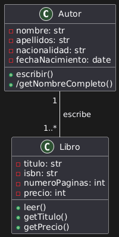
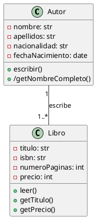

# Solución: Ejercicio 1 - Sistema de Libros y Autores

## Análisis del Problema

### Identificación de Clases

Del análisis de las especificaciones, identificamos las siguientes clases:

1. **Autor**
   - Representa a un autor que escribe libros.
   - Atributos: nombre, apellidos, nacionalidad, fechaNacimiento
   - Métodos: escribir(), /getNombreCompleto()

2. **Libro**
   - Representa un libro que puede ser leído.
   - Atributos: titulo, isbn, numeroPaginas, precio
   - Métodos: leer(), getTitulo(), getPrecio()

## Análisis de Relaciones

### Asociación simple (Autor - Libro)
- **Nombre**: "escribe"
- **Tipo**: Asociación simple (no composición, porque el libro puede existir aunque el autor muera)
- **Cardinalidad**: 
  - Un Autor tiene 1..* Libros (mínimo 1, sin máximo)
  - Un Libro tiene en 1 Autor
- **Justificación**: El Libro necesita un Autor para existir, y un Autor puede tener varios libros

## Tabla de Roles y Cardinalidades

| Relación | Clase Origen | Rol Origen | Cardinalidad Origen | Clase Destino | Rol Destino | Cardinalidad Destino |
|----------|--------------|------------|---------------------|---------------|-------------|----------------------|
| Asociación Simple | Autor | libros | 1..* | Libro | autor | 1 |

## Diagrama de Clases



## Código PlantUML



## Implementación en Kotlin

```kotlin
class Autor(
    private val nombre: String,
    private val val apellidos: String,
    private val nacionalidad: String,
    private val fechaNacimiento: LocalDate
) {

    fun escribir() {}
    fun getNombreCompleto(): String {}
}

class Libro(
    private val titulo: String,
    private val isbn: String,
    private val numeroPaginas: Int,
    private val precio: Int 
) {

    fun leer() {}
    fun getTitulo(): String {}
    fun getPrecio(): Int {}
}
```