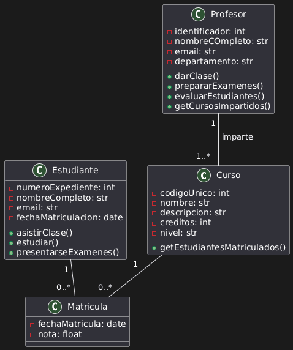
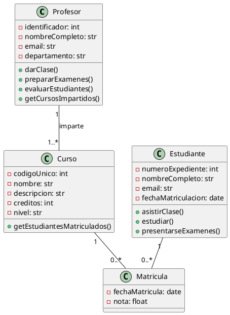

# Solución: Ejercicio 1 - Sistema de Libros y Autores

## Análisis del Problema

### Identificación de Clases

Del análisis de las especificaciones, identificamos las siguientes clases:

1. **Profesor**
   - Representa al encargado de dar las asignaturas.
   - Atributos: identificador, nombreCompleto, email, departamento
   - Métodos: darClase(), prepararExamenes(), evaluarEstudiantes(), getCursosImpartidos()

2. **Curso**
   - Representa la asignatura dada por el profesor.
   - Atributos: codigoUnico, nombre, descripcion, creditos, nivel
   - Métodos: getEstudiantesMatriculados()

3. **Estudiante**
   - Representa al alumno matriculado.
   - Atributos: numeroExpediente, nombreCompleto, email, fechaMatriculacion, nivel
   - Métodos: getEstudiantesMatriculados()

4. **Matricula**
   - Representa la matricula que vincula al estudiante con los cursos que da.
   - Atributos: fechaMatricula, nota

## Análisis de Relaciones

### 1. Asociación (Profeor - Curso)
- **Nombre**: "imparte"
- **Tipo**: De 1 a muchos
- **Cardinalidad**: 
  - Un Profesor imparte 1..* Cursos (mínimo 1, sin máximo)
  - Un Curso debe ser impartido por 1 Profesor
- **Justificación**: El curso la puede dar solo un profesor, pero un profesor puede dar varios cursos

### 2. Asociación (Estudiante - Matricula)
- **Tipo**: De 1 a muchos
- **Cardinalidad**: 
  - Un Estudiante tiene 0..* Matriculas
  - Una Matricula pertenece a 1 Estudiante
- **Justificación**: Un Estudiante puede estar matricuado en varios Cursos, pero una Matricula solo puede pertenecer a un alumno

### 3. Asociación (Curso - Matricula)
- **Tipo**: De 1 a muchos
- **Cardinalidad**: 
  - Un Curso tiene 0..* Matriculas
  - Una Matricula pertenece a 1 Curso
- **Justificación**: Un Curso tiene muchos alumnos inscritos (por las matriculas), pero una Matricula solo puede pertenecer a un alumno

## Tabla de Roles y Cardinalidades

| Relación | Clase Origen | Rol Origen | Cardinalidad Origen | Clase Destino | Rol Destino | Cardinalidad Destino |
|----------|--------------|------------|---------------------|---------------|-------------|----------------------|
| Asociación | Profesor | cursos | 1..* | Curso | profesor | 1 |
| Asociación | Estudiante | matriculas | 0..* | Matricula | estudiante | 1 |
| Asociación | Curso | matriculas | 0..* | Matricula | curso | 1 |

## Diagrama de Clases



## Código PlantUML



## Implementación en Kotlin

```kotlin
TODO("Por hacer")
```