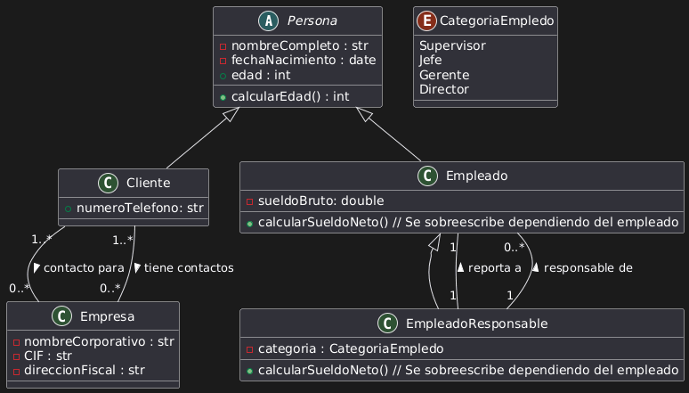
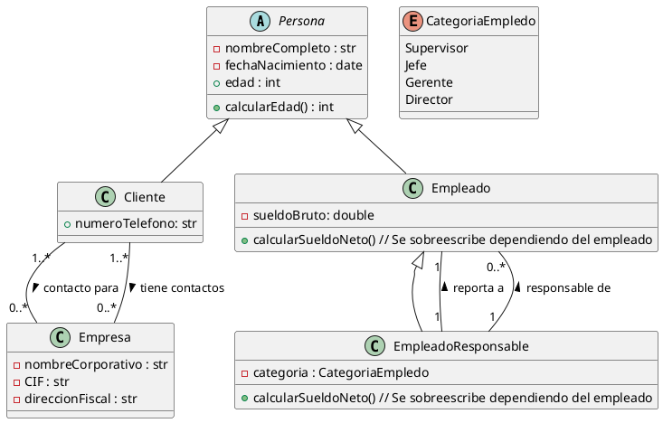

# Solución: Ejercicio 1 - Sistema de Libros y Autores

## Análisis del Problema

### Identificación de Clases

Del análisis de las especificaciones, identificamos las siguientes clases:

1. **Persona**
  - La clase base para el resto de personas.
  - Atributos: nombreCompleto, fechaNacimiento, edad
  - Métodos: calcularEdad()

2. **Cliente**
  - Representa la persona que actua como cliente de la empresa.
  - Atributos: numeroTelefono

3. **Empleado**
  - Representa la persona que actua como empleado de la empresa.
  - Atributos: sueldoBruto
  - Métodos: calcularSueldoNeto()

4. **EmpleadoResponsable**
  - Representa la persona que actua como empleado responsable de la empresa.
  - Atributos: categoria
  - Métodos: calcularSueldoNeto

5. **Empresa**
  - Representa la empresa.
  - Atributos: nombreCorporativo, CIF, direccionFiscal

6. **CategoriaEmpledo**
  - Representa la categoria que tiene el empleado.
  - Valores: Supervisor, Jefe, Gerente, Director

## Análisis de Relaciones

### 1. Asociación (Empleado - EmpleadoResponsable)
- **Nombre**: "responsable de" / "reporta a"
- **Tipo**: De muchos a muchos
- **Cardinalidad**: 
  - Un EmpleadoResponsable es responsable de 0 o más Empleados.
  - Un Empleado debe reportar a exactamente 1 EmpleadoResponsable (su jefe directo)
- **Justificación**: Cada empleado tiene un único responsable, y un responsable puede tener varios empleados a su cargo.

### Asociación (Cliente - Empresa)
- **Nombre**: "contacto para" / "tiene contactos"
- **Tipo**: De muchos a muchos
- **Cardinalidad**: 
  - Un Cliente puede ser contacto para 1 o más empresas
  - Una Empresa puede tener 1 o más Clientes como contactos
- **Justificación**: Una empresa interactúa con varios clientes, y un cliente puede ser contacto para varias empresas

## Tabla de Roles y Cardinalidades

| Relación | Clase Origen | Rol Origen | Cardinalidad Origen | Clase Destino | Rol Destino | Cardinalidad Destino |
|----------|--------------|------------|---------------------|---------------|-------------|----------------------|
| Asociación | EmpleadoResponsable | empleadosACargo | 0..* | Empleado | profesor | 1 |
| Asociación | Empleado | reportaA | 1 | Matricula | EmpleadoResponsable | 1 |
| Asociación | Cliente | empresas | 1..* | Matricula | Empresa | 1 |
| Asociación | Empresa | clientes | 0..* | Matricula | Cliente | 1 |

## Diagrama de Clases



## Código PlantUML



## Implementación en Kotlin

```kotlin
TODO("Por hacer")
```