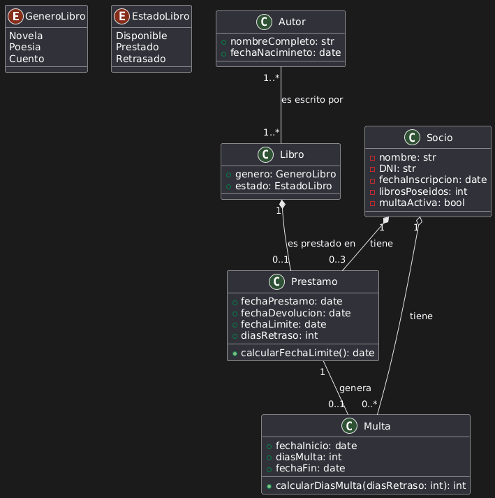
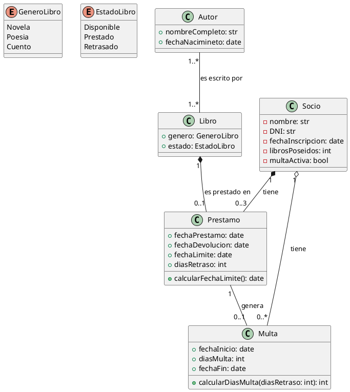

# Solución: Ejercicio 1 - Sistema de Libros y Autores

## Análisis del Problema

### Identificación de Clases

Del análisis de las especificaciones, identificamos las siguientes clases:

1. **Autor**
  - Representa al escritor del Libro.
  - Atributos: nombreCompleto, fechaNacimiento

2. **Libro**
  - Representa el Libro escrito por el Autor.
  - Atributos: genero, estado

3. **Socio**
  - Representa a la persona que se ha hecho Socio en la Biblioteca.
  - Atributos: nombre, DNI, fechaInscripcion, librosPoseidos, multaActiva

4. **Multa**
  - Representa la multa recibida por el Socio si no devuelve el Libro a tiempo.
  - Atributos: fechaInicio, diasMulta, fechaFin
  - Métodos: calcularDiasMulta()

5. **Prestamo**
  - Representa el prestamo del Libro al Socio.
  - Atributos: fechaPrestamo, fechaDevolucion, fechaLimite, diasRetraso
  - Métodos: calcularFechaLimite()

6. **GeneroLibro**
  - Representa los géneros a los que puede pertener el Libro.
  - Valores: Novela, Poesia, Cuento

6. **EstadoLibro**
  - Representa los estados en los que puede estar el Libro.
  - Valores: Disponible, Prestado, Retrasado

## Análisis de Relaciones

### 1. Asociación (Autor - Libro)
- **Nombre**: "es escrito por"
- **Tipo**: De muchos a muchos
- **Cardinalidad**: 
  - Un Libro es escrito por 1 o más Autores.
  - Un Autor escribe 1 o mas Libros.

### Asociación (Socio - Multa)
- **Nombre**: "tiene"
- **Tipo**: De 1 a muchos
- **Cardinalidad**: 
  - Un Socio puede tener 1 o muchas multas.
  - Una Multa solo puede pertener a un Socio.

### Asociación (Socio - Prestamo)
- **Nombre**: "tiene"
- **Tipo**: De 1 a 3
- **Cardinalidad**: 
  - Un Socio puede tener de 0 a 3 Libros.
  - Un Libro solo puede pertener a un Socio.

## Tabla de Roles y Cardinalidades

| Relación | Clase Origen | Rol Origen | Cardinalidad Origen | Clase Destino | Rol Destino | Cardinalidad Destino |
|----------|--------------|------------|---------------------|---------------|-------------|----------------------|
| Asociación | Autor | es escrito por | 1..* | Libro | Libro | 1..* |
| Asociación | Socio | tiene | 1 | Multa | es de | 0..* |
| Asociación | Socio | tiene prestamos | 1 | Prestamo | socio | '..3 |

## Diagrama de Clases



## Código PlantUML



## Implementación en Kotlin

```kotlin
enum class GeneroLibro {
    Novela,
    Poesia,
    Cuento
}

enum class EstadoLibro {
    Disponible,
    Prestado,
    Retrasado
}

class Autor(
    val nombreCompleto: String,
    val fechaNacimineto: LocalDate
)

class Libro(
    val genero: GeneroLibro,
    val estado: EstadoLibro
)

class Socio(
    private val nombre: String,
    private val dni: String,
    private val fechaInscripcion: LocalDate,
    var librosPoseidos: Int,
    var multaActiva: Boolean
)

class Multa(
    val fechaInicio: LocalDate,
    val diasMulta: Int,
    val fechaFin: LocalDate
) {
    fun calcularDiasMulta(diasRetraso: Int): Int {}
}

class Prestamo(
    val fechaPrestamo: LocalDate,
    val fechaDevolucion: LocalDate,
    val fechaLimite: LocalDate,
    val diasRetraso: Int
) {
    fun calcularFechaLimite() {}
}
```