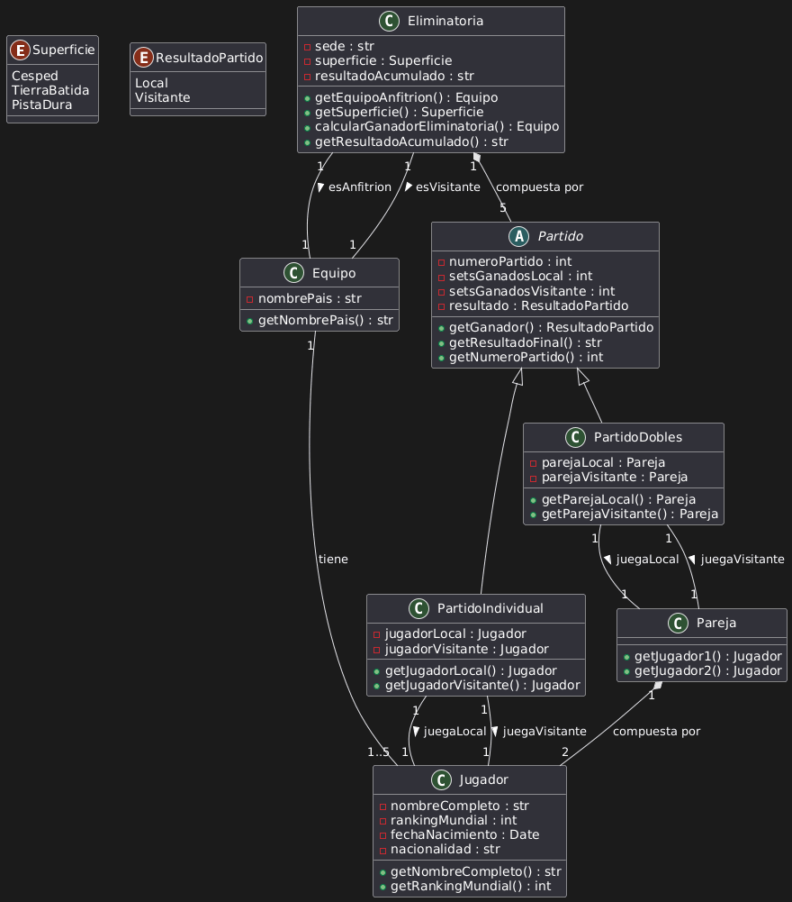

# Ejercicio 7: Diagrama de Clases - Copa Davis de Tenis

## Análisis del Problema

## Análisis del Modelo de Clases de la Copa Davis

Del análisis de las especificaciones, identificamos las siguientes clases:

1.  **Eliminatoria**
    * Representa el partido entre dos equipos.
    * **Atributos**: sede, superficie, resultadoAcumulado.
    * **Métodos**: getEquipoAnfitrion(), getSuperficie(), calcularGanadorEliminatoria(), getResultadoAcumulado().
2.  **Equipo**
    * Representa al país competidor.
    * **Atributos**: nombrePais.
    * **Métodos**: getNombrePais().
3.  **Jugador**
    * Representa al tenista individual.
    * **Atributos**: nombreCompleto, rankingMundial, fechaNacimiento, nacionalidad.
    * **Métodos**: `getNombreCompleto()`, `getRankingMundial()`.
4.  **Partido**
    * Clase base abstracta para cualquier partido.
    * **Atributos**: numeroPartido, setsGanadosLocal, setsGanadosVisitante, resultado.
    * **Métodos**: getGanador(), getResultadoFinal(), getNumeroPartido().
5.  **PartidoIndividual**
    * Representa un partido 1 contra 1.
    * **Atributos**: jugadorLocal, jugadorVisitante.
6.  **PartidoDobles**
    * Representa un partido 2 contra 2.
    * **Atributos**: parejaLocal, parejaVisitante.
7.  **Pareja**
    * Representa los dos jugadores para un partido de dobles.
    * **Métodos**: getJugador1(), getJugador2().
8.  **Superficie**
    * Valores: Cesped, TierraBatida, PistaDura.
9.  **ResultadoPartido**
    * Valores: Local, Visitante.

---

## Análisis de Relaciones

### 1. Composición (Eliminatoria - Partido)
* **Tipo**: Composición Fuerte.
* **Cardinalidad**: Una Eliminatoria debe estar compuesta exactamente por 5 Partidos (4 individuales + 1 dobles).

### 2. Asociación (Equipo - Jugador)
* **Tipo**: Asociación con restricción.
* **Cardinalidad**: Un Equipo está asociado a un mínimo de 1 y un máximo de 5 Jugadores para esa eliminatoria. Un Jugador debe pertenecer a 1 Equipo.

### 3. Asociación (Eliminatoria - Equipo)
* **Tipo**: Asociación.
* **Cardinalidad**: Una Eliminatoria tiene exactamente 2 Equipos, uno con rol de Anfitrión y otro de Visitante.

### 4. Asociación (PartidoIndividual - Jugador)
* **Tipo**: Asociación.
* **Cardinalidad**: Un PartidoIndividual relaciona 1 Jugador (Local) y 1 Jugador (Visitante).

### 5. Composición (Pareja - Jugador)
* **Tipo**: Composición Fuerte.
* **Cardinalidad**: Una Pareja está compuesta exactamente por 2 Jugadores.

### 6. Asociación (PartidoDobles - Pareja)
* **Tipo**: Asociación.
* **Cardinalidad**: Un PartidoDobles relaciona 1 Pareja (Local) y 1 Pareja (Visitante).

---

## Diagrama de Clases



## Código PlantUML

```plantuml
enum Superficie {
  Cesped
  TierraBatida
  PistaDura
}

enum ResultadoPartido {
  Local
  Visitante
}

class Jugador {
    'ATRIBUTOS'
    - nombreCompleto : str
    - rankingMundial : int
    - fechaNacimiento : Date
    - nacionalidad : str
    'MÉTODOS'
    + getNombreCompleto() : str
    + getRankingMundial() : int
}

class Equipo {
    'ATRIBUTOS'
    - nombrePais : str
    'MÉTODOS'
    + getNombrePais() : str
}

class Eliminatoria {
    'ATRIBUTOS'
    - sede : str
    - superficie : Superficie
    - resultadoAcumulado : str
    'MÉTODOS'
    + getEquipoAnfitrion() : Equipo
    + getSuperficie() : Superficie
    + calcularGanadorEliminatoria() : Equipo
    + getResultadoAcumulado() : str
}

abstract class Partido {
    'ATRIBUTOS'
    # numeroPartido : int
    # setsGanadosLocal : int
    # setsGanadosVisitante : int
    - resultado : ResultadoPartido
    'MÉTODOS'
    + getGanador() : ResultadoPartido
    + getResultadoFinal() : str
    + getNumeroPartido() : int
}

class PartidoIndividual extends Partido {
    'ATRIBUTOS'
    - jugadorLocal : Jugador
    - jugadorVisitante : Jugador
    'MÉTODOS'
    + getJugadorLocal() : Jugador
    + getJugadorVisitante() : Jugador
}

class Pareja {
    'MÉTODOS'
    + getJugador1() : Jugador
    + getJugador2() : Jugador
}

class PartidoDobles extends Partido {
    'ATRIBUTOS'
    - parejaLocal : Pareja
    - parejaVisitante : Pareja
    'MÉTODOS'
    + getParejaLocal() : Pareja
    + getParejaVisitante() : Pareja
}

'RELACIONES'

Equipo "1" -- "1..5" Jugador : "tiene"

Eliminatoria "1" -- "1" Equipo : esAnfitrion >
Eliminatoria "1" -- "1" Equipo : esVisitante >

Eliminatoria "1" *-- "5" Partido : "compuesta por"

PartidoIndividual "1" -- "1" Jugador : juegaLocal >
PartidoIndividual "1" -- "1" Jugador : juegaVisitante >

Pareja "1" *-- "2" Jugador : "compuesta por"

PartidoDobles "1" -- "1" Pareja : juegaLocal >
PartidoDobles "1" -- "1" Pareja : juegaVisitante >
```

## Implementación en Kotlin

```kotlin
enum class Superficie {
    Cesped,
    TierraBatida,
    PistaDura
}

enum class ResultadoPartido {
    Local,
    Visitante
}

class Jugador(
    private val nombreCompleto: String,
    private val rankingMundial: Int,
    private val fechaNacimiento: LocalDate,
    private val nacionalidad: String
) {
    fun getNombreCompleto(): String {}
    fun getRankingMundial(): Int {}
}

class Equipo(
    private val nombrePais: String
) {
    fun getNombrePais(): String {}
}

class Eliminatoria(
    private val sede: String,
    private val superficie: Superficie,
    private val resultadoAcumulado: String
) {
    fun getEquipoAnfitrion(): Equipo {}
    fun getSuperficie(): Superficie {}
    fun calcularGanadorEliminatoria(): Equipo {}
    fun getResultadoAcumulado(): String {}
}

abstract class Partido(
    protected val numeroPartido: Int,
    protected val setsGanadosLocal: Int,
    protected val setsGanadosVisitante: Int,
    private val resultado: ResultadoPartido
) {
    open fun getGanador(): ResultadoPartido {}
    open fun getResultadoFinal(): String {}
    open fun getNumeroPartido(): Int {}
}

class PartidoIndividual(
    numeroPartido: Int,
    setsGanadosLocal: Int,
    setsGanadosVisitante: Int,
    resultado: ResultadoPartido,
    private val jugadorLocal: Jugador,
    private val jugadorVisitante: Jugador
) : Partido(numeroPartido, setsGanadosLocal, setsGanadosVisitante, resultado) {
    
    fun getJugadorLocal(): Jugador {}
    fun getJugadorVisitante(): Jugador {}
}

class Pareja {
    fun getJugador1(): Jugador {}
    fun getJugador2(): Jugador {}
}

class PartidoDobles(
    numeroPartido: Int,
    setsGanadosLocal: Int,
    setsGanadosVisitante: Int,
    resultado: ResultadoPartido,
    private val parejaLocal: Pareja,
    private val parejaVisitante: Pareja
) : Partido(numeroPartido, setsGanadosLocal, setsGanadosVisitante, resultado) {
    fun getParejaLocal(): Pareja {}
    fun getParejaVisitante(): Pareja {}
}
```